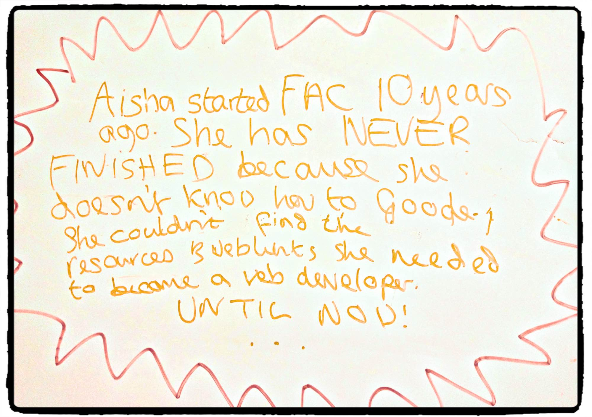
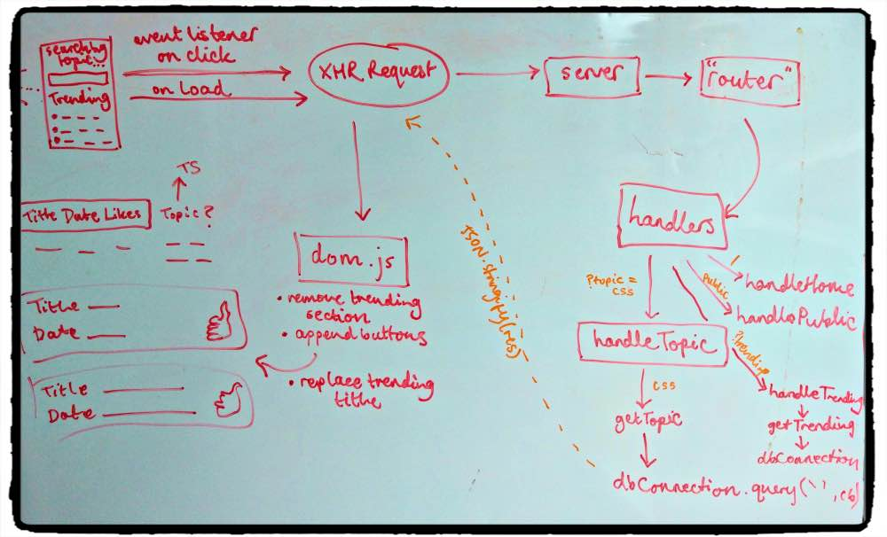
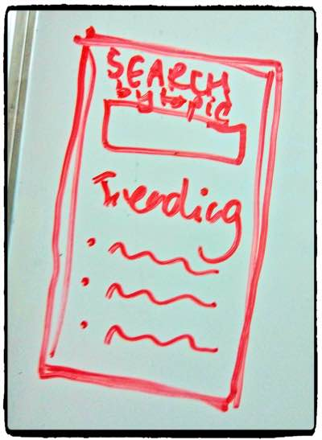

# theLibrary
A centralised postgresql resource for FAC

# theLibrary :zap:

## Requirements

- [x] Simple web app with a node server and a database
- [x] Your database comes with a schema, which should be documented in your readme (along with any other architectural decisions)
- [x] Database hosted on Heroku, or locally
- [x] Build script for your database
- [ ] Security concerns appropriately considered (you must protect against script injections!)
- [x] Good test coverage both server- and client-side
- [x] Content dynamic, but DOM manipulation kept to a minimum
- [x] Mobile-first design
- [x] Clear user journey (even if you take one of our suggested ideas, document the user journey in your readme)

## User story

> I can pick a topic and find a bunch of rad online resources with an article title, print data and link :link:

> On load I can find out about the coolest articles peeps are raving about :cool: :cool: :cool:
## Planning: architecture and flow

We planned out our flow as follows:


And wanted it to look like this:



## Database Schema

### resources  :books:
| Column | Type| Modifier |
| -------- | -------- | -------- |
| id     | serial     |   PRIMARY KEY   |
| title   |  VARCHAR(300) |   NOT NULL  |
| link   |  VARCHAR(300) |  NOT NULL   |
| publish_month    |  INTEGER |     |
| publish_year     |  INTEGER |      |
| upvotes     | INTEGER  |   DEFAULT 0  |

### topics  :computer:
| Column | Type| Modifier |
| -------- | -------- | -------- |
| id     | serial     |   PRIMARY KEY   |
| topic   |  VARCHAR(300) |   NOT NULL  |
| week   |  INTEGER |     |

### resources_topics  :bookmark_tabs:
| Column | Type| Modifier |
| -------- | -------- | -------- |
| resource_id    | INTEGER REFERENCES resources(id)    |   ON UPDATE CASCADE   |
| topic_id   |  INTEGER REFERENCES topics(id) |   ON UPDATE CASCADE  |


## What we decided on and how we decided to do it

## Cool learnings
* Turns out sql **hates** capital letters! You can't name databases with caps :crying_cat_face:
* ALSO atom is a thief! :oncoming_police_car: And sometimes steals your letters from terminal
* Writing tests within a foreach loop which take a callback :fearful:
 ```
 const topicArray = ['Javascript', 'CSS', 'Node', 'Databases', 'Accessibility', 'Git', 'TDD', 'HTTP', 'APIs', 'Callbacks', 'Software Architecture', 'Servers', 'Development Methodologies', 'HTML', 'UX'];
 topicArray.forEach((topic) => {
   tape(`getTopic ${topic} query`, (t) => {
     getTopic(topic, (err, res) => {
       const actual = res[0].topic;
       const expected = topic;
       t.equals(actual, expected, `getTopic object output topic should be ${topic}`);
       t.end();
     });
   });
 });
```

* Pushing to heroku from a local branch:

```git push heroku yourbranch:master```

## Good links
